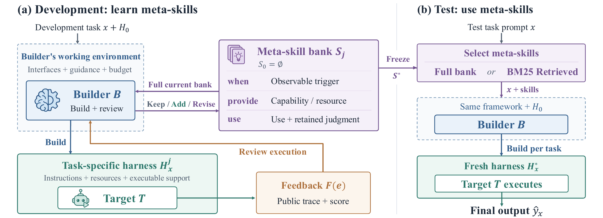

# Learning Meta-Skills for Agent Harness Design in Test-Time AI4AI

This is the official repository for the paper **Learning Meta-Skills for Agent Harness Design in Test-Time AI4AI**.



The figure shows how the Builder learns reusable meta-skills from public development feedback and uses them to design a harness for a Target agent. A [vector PDF of the figure](assets/method.pdf) is also available.

This release contains the core Builder, harness, and Target interfaces. It is intentionally small: paper drafts, experiment outputs, plots, and the full benchmark campaign are not included.

## What is included

- **Seven harness components:** `instruction`, `memory`, `tools`, `context`, `controller`, `verification`, and `workspace`. Disabled components are `null`; enabled components contain bounded policy functions. Composed tools can call the native tools supplied by an adapter.
- **A fixed runtime boundary:** schema validation, a restricted policy interpreter, task-local state, model and tool budgets, and the Target's tool loop. Builder-generated source is interpreted without Python `exec` or `eval`.
- **A Builder refinement loop:** the Builder constructs a bundle, reviews a public training episode, keeps or updates a `when` / `provide` / `use` support skill, and refines the bundle. Interface repairs do not use Target scores to select candidates.
- **Official model APIs:** [OpenAI Responses](https://developers.openai.com/api/docs/guides/function-calling) and [Anthropic Messages](https://platform.claude.com/docs/en/api/messages/create). The clients read `OPENAI_API_KEY` or `ANTHROPIC_API_KEY` from the environment. The package has no third-party runtime dependencies.

The diagram describes the paper's complete method, including test-task-specific construction and skill retrieval. This minimal release exposes the components needed to build and run harnesses; it does not include the paper's full experiment scheduler or BM25 retrieval pipeline.

## Quick start

From the repository root:

```sh
python -m pip install -e .
export OPENAI_API_KEY="..."  # Or set ANTHROPIC_API_KEY for Claude.

python -m meta_skill_ai4ai build \
  --adapter examples.catalog_adapter --provider openai --model gpt-4.1-mini \
  --card examples/benchmark_card.json --output /tmp/meta-bundle.json

python -m meta_skill_ai4ai run \
  --adapter examples.catalog_adapter --provider openai --model gpt-4.1-mini \
  --bundle /tmp/meta-bundle.json --task-id catalog-1 \
  --output /tmp/meta-episode.json

python -m meta_skill_ai4ai learn \
  --adapter examples.catalog_adapter --provider openai --model gpt-4.1-mini \
  --bundle /tmp/meta-bundle.json --episode /tmp/meta-episode.json \
  --output /tmp/meta-skills.json

python -m meta_skill_ai4ai refine \
  --adapter examples.catalog_adapter --provider openai --model gpt-4.1-mini \
  --card examples/benchmark_card.json --bundle /tmp/meta-bundle.json \
  --skills /tmp/meta-skills.json --output /tmp/meta-refined.json
```

For Claude, use `--provider anthropic --model <Claude model ID>` and set `ANTHROPIC_API_KEY`. The Builder and Target may use different providers and models. Each task starts with a fresh session; Python callers can pass a `ModularSession` explicitly to continue the same task. `TargetBudget` limits model calls, native tool calls, tokens, and wall time.

## Adapter interface

An adapter provides the public tools and loads a concrete task only when the Target is run. See [examples/catalog_adapter.py](examples/catalog_adapter.py) for a working example.

```python
from meta_skill_ai4ai import TargetTask, Tool, ToolResult

def public_tools() -> list[Tool]:
    # Return the shared tool names, descriptions, JSON schemas, and handlers.
    ...

def load_task(task_id: str) -> tuple[TargetTask, list[Tool]]:
    # Load a concrete task. Tool names must match public_tools().
    ...

def public_feedback(result) -> dict:  # Optional.
    # Include only training feedback that the Builder is allowed to see.
    ...
```

`Tool.handler(arguments)` returns `ToolResult(ok, observation, error_type)`. Set `terminal_reason` when the native environment must stop immediately, or `infrastructure_failure=True` for an infrastructure error. Harness scratch files live in a separate temporary workspace. Native task files and scoring are exposed only through the adapter's tools and public feedback.

## Tests

```sh
python -m unittest discover -s tests -v
```

The tests cover bundle construction, a Target tool call, skill reflection, refinement, and the request and response shapes of both official API adapters. The interpreter and runtime retain the original `modular-v2.0` execution boundary.
